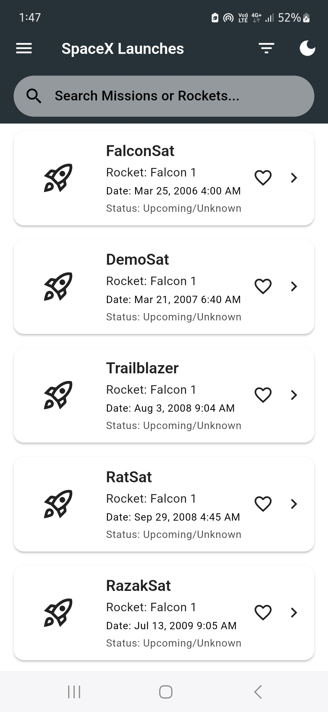
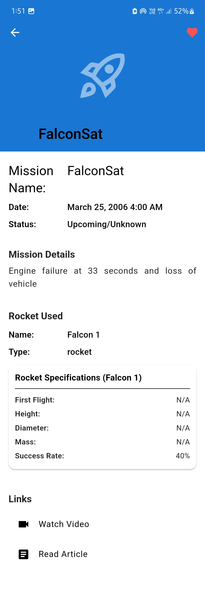
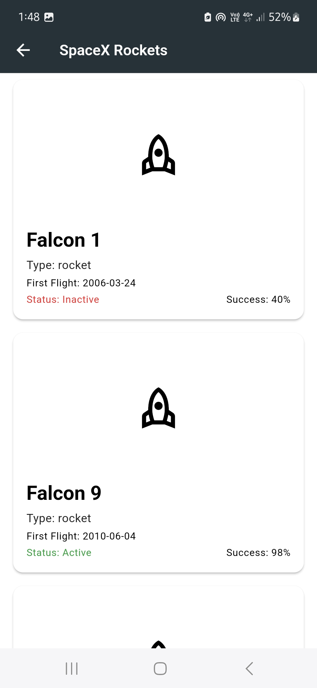
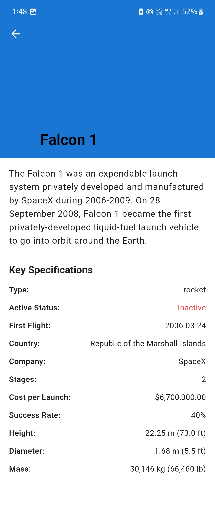

# chiragar-spacex_explore 🚀

SpaceX Explorer is a Flutter mobile application that allows users to explore SpaceX data, including past launches, rockets, and company information, using the official SpaceX GraphQL API.

<!-- Optional: Add build status, code coverage badges if you set them up -->

## Features

*   **Launch Explorer:**
    *   Paginated list of past SpaceX launches.
    *   Displays mission patch, name, date, rocket used, and success status.
    *   Search functionality for missions and rockets.
    *   Filtering by launch year, success/failure status, and rocket type.
    *   Pull-to-refresh to update launch data.
*   **Launch Details Screen:**
    *   Detailed view of a specific launch.
    *   Displays mission details, photo gallery (from Flickr), and video links (YouTube).
    *   Shows launch site name.
    *   Includes specifications of the rocket used for that launch.
*   **Rocket Catalog:**
    *   List of all SpaceX rockets with key specifications.
    *   Detailed view for each rocket showing images, full specs, and success rates.
    *   (Optional: Visual comparison tool between selected rockets - *describe if implemented*).
*   **Company Information:**
    *   (Optional: Screen displaying SpaceX company overview, founder, valuation, etc. - *describe if implemented*).
*   **Favorites System:**
    *   Users can bookmark their favorite launches.
    *   A dedicated screen to view all favorited launches.
*   **UI/UX:**
    *   Modern, responsive UI following Material Design 3 principles.
    *   Smooth animations and transitions.
    *   Support for both Light and Dark themes.
    *   Proper error and empty state handling.
*   **Cross-Platform:**
    *   Supports both iOS and Android platforms.
    *   Responsive design for various screen sizes and orientations.
*   **Accessibility:**
    *   Basic considerations for screen reader support and contrast.

## Screenshots

*(Replace with actual paths to your screenshots after creating a `screenshots` directory in your project root)*

## API Reference

This application uses the public SpaceX GraphQL API:
*   **API Explorer:** [SpaceX GraphQL Studio](https://studio.apollographql.com/public/SpaceX-pxxbxen/variant/current/home)

## Tech Stack & Architecture

### Core Technologies

*   **Flutter:** UI toolkit for building natively compiled applications for mobile, web, and desktop from a single codebase.
*   **Dart:** Programming language used by Flutter.
*   **GraphQL:** Query language for the API, using the `graphql_flutter` package.

### Architecture

The application follows the **Clean Architecture** pattern, promoting a clear separation of concerns into three main layers:

1.  **Presentation Layer:** (Flutter Widgets, BLoCs/Cubits)
    *   Handles UI and user interaction.
    *   Uses the BLoC (Business Logic Component) pattern for state management.
    *   Contains Pages (Screens) and Widgets.
2.  **Domain Layer:** (Entities, Use Cases, Abstract Repositories)
    *   Contains the core business logic and rules.
    *   Entities represent business objects (e.g., `Launch`, `Rocket`).
    *   Use Cases orchestrate data flow between Presentation and Data layers.
    *   Independent of UI and data source implementation.
3.  **Data Layer:** (Repositories Implementation, Data Sources, Models)
    *   Handles data retrieval and storage.
    *   Repositories implement interfaces defined in the Domain layer.
    *   Data Sources interact with external sources (GraphQL API, Local Storage).
    *   Models (DTOs) represent data structure from the API.

### State Management

*   **BLoC (Business Logic Component) / Cubit:** Utilized for managing the state of the application.
    *   `flutter_bloc` package is used for implementation.
    *   Handles loading, success, and error states for UI components.
    *   Events trigger state changes in BLoCs, while Cubits expose methods to emit new states.

### GraphQL Implementation

*   **`graphql_flutter` package:** Used as the GraphQL client.
*   **Structured Queries:** GraphQL queries are defined in `.dart` files, utilizing fragments for reusable fields.
*   **Efficient Data Fetching:** Pagination is implemented for launch lists.
*   **Error Handling:** API request errors are handled and displayed to the user.
*   **Caching:** The `graphql_flutter` client uses `HiveStore` for persistent caching of API responses, aiding in quicker data loads and some offline resilience.

